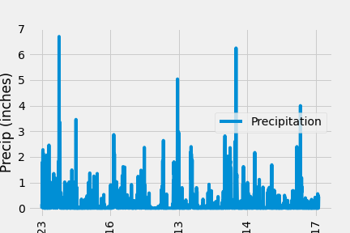
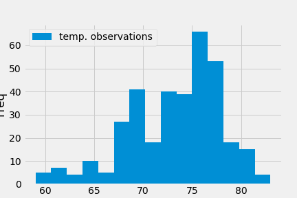

# sqlalchemy-challenge

## Part One: Climate Data Exploration
In this challenge, Python,  SQLAlchemy, and Flask were used to do a basic climate analysis and data exploration of a climate database, and a Flask API was designed based on the queries that were developed in the first part.
### Precipitation Analysis
 
See code and results in the accompanying climate_starter.ipynb file. Figure 1 below shoes the ploy of precipitation readings during the year before the most recent date in the database.
 
 

Figure 1. Precipitation readings from 2016.08.23 to 2017.08.23.
 
 
Table 1 displays the summary statistics for the precipitation data.
 
 
Table 1. Summary statistics of precipitation data. 
<table>
    <tr>
        <td>count</td>
        <td>2021.000000</td>
    </tr>
    <tr>
        <td>mean</td>
        <td>0.177279</td>
    </tr>
    <tr>
        <td>std</td>
        <td>0.461190</td>
    </tr>
    <tr>
        <td>min</td>
        <td>0.000000</td>
    </tr>
    <tr>
        <td>25%</td>
        <td>0.000000</td>
    </tr>
    <tr>
        <td>50%</td>
        <td>0.020000</td>
    </tr>
    <tr>
        <td>75%</td>
        <td>0.130000</td>
    </tr>
    <tr>
        <td>max</td>
        <td>6.700000</td>
    </tr>
</table>

### Station and Temperature Analysis

See code and results in the accompanying climate_starter.ipynb file. Figure 2 shows a histograms for the temperature readings at the most active station: .
 
 

Figure 2. Frequency of temperature readings for station USC00519281.

## Part Two
App code can be found in the app.py file
